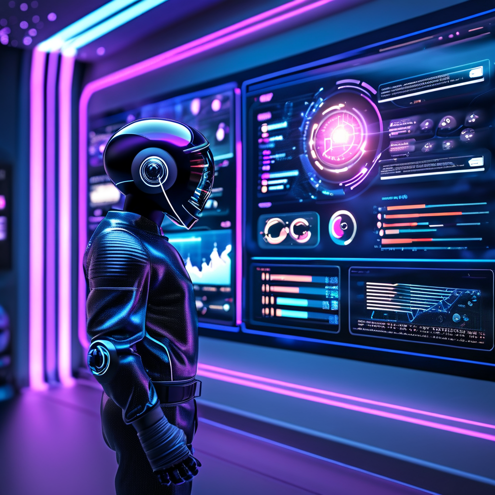

# 聊聊 MCP App 的产生背景和当前最新进展

2026 年 1 月 26 日，MCP 官方正式发布了 MCP Apps 1.0 稳定版。这消息一出，我第一反应是：终于来了。

你可能会问：不是说好的 AI 对话吗，怎么又要写界面了？AI 不是应该越来越智能、越来越「懂」我们吗，为什么还要搞什么 UI？

我理解这种困惑。但如果你和我一样，在过去一年里吭哧吭哧地用各种 AI Agent 工具做实际工作，你一定也有过这种时刻——让 AI 帮你分析数据，它吐出一大串 JSON；让它生成报表，它给你一堆 Markdown 表格；你想看个可视化图表，它说「您可以把这些数据复制到 Excel 里画一下」。

那一刻，你是不是也替它着急？

---

## 01 / 一个尴尬的现实：AI 只会「说」

MCP（Model Context Protocol）在设计之初，主要解决的是 AI 模型与外部数据/工具的连接问题。它定义了三种核心原语：Tools（工具）、Resources（资源）、Prompts（提示词）。这套设计非常优雅，解决了 AI「手脚不够用」的问题。

但有个问题它没解决：**AI 只能「说」，不能「展示」**。

什么意思？MCP 原本只支持文本和结构化数据的交换。当你让 AI 分析销售数据时，它能帮你查数据库、算指标，但最终只能把结果用文字或 JSON 告诉你。如果你想要一个饼图、一个可交互的仪表盘，对不起，自己想办法。

这就像你雇了个超级聪明的分析师，但他只会打电话汇报，不会画 PPT。

我在实际使用中对这个问题体感太深了。有一次我让 Claude 帮我分析一个开源项目的代码结构，它巴拉巴拉说了一大堆，我听完还是一头雾水。后来我用一个可视化工具画了个架构图，3 秒就看明白了。那一刻我就在想：**为什么 AI 不能直接给我画这张图呢？**

---

## 02 / 社区早已按捺不住

其实这个需求，社区比官方更早嗅到了。

**MCP-UI 社区项目**：由 Ido Salomon 和 Liad Yosef 创建的 [MCP-UI](https://mcpui.dev/) 项目，在官方规范出台前就已经积累了 4.2k+ stars。他们证明了一件事：UI 资源可以很自然地融入 MCP 架构。这个项目被 Postman、Shopify、Hugging Face、Goose 等大厂和知名项目采用，成为事实上的先行探索者。

**Working Group 讨论**：2025 年中，社区在 MCP 工作组提出了 "UI Component Integration in MCP Responses" RFC（Issue #35），讨论如何在 MCP 响应中集成 UI 组件。讨论非常热烈，大家的诉求包括：

- 交互式表单、按钮、多步工作流
- 实时数据可视化（图表、仪表盘）
- 配置向导（多选项、条件依赖）
- 富媒体查看器（PDF、3D 模型、视频）

**OpenAI Apps SDK**：与此同时，OpenAI 也在 ChatGPT 里搞了个类似的东西——[Apps SDK](https://developers.openai.com/apps-sdk/)，让开发者可以在 ChatGPT 里构建带 UI 的应用。这进一步验证了市场需求。

我一直在跟踪这些进展，越看越觉得：**这不是一个「要不要有」的问题，而是一个「什么时候有」的问题**。需求是自下而上爆发的，社区等不及了。

---

## 03 / Anthropic 和 OpenAI 罕见握手

接下来发生的事情，让我有点意外。

2025 年 11 月 21 日，MCP 团队发布了 MCP Apps 的首次公开预览（[SEP-1865](https://github.com/modelcontextprotocol/modelcontextprotocol/pull/1865)）。让我惊讶的不是规范本身，而是参与者名单：

- **Anthropic**：Anton Pidkuiko、Olivier Chafik、Sean Strong、Jerome Swannack
- **OpenAI**：Nick Cooper、Alexei Christakis、Bryan Ashley
- **MCP-UI**：Ido Salomon、Liad Yosef

你没看错，**Anthropic 和 OpenAI 两家「竞争对手」坐在一起，共同制定了这个规范**。

在 AI 领域，这种级别的跨公司协作极其罕见。两家公司在大模型赛道上打得火热，却能在协议层面放下竞争、联手合作。这说明什么？说明大家都意识到：**碎片化是整个生态的敌人**。

如果 Claude 有 Claude 的 UI 方案、ChatGPT 有 ChatGPT 的 Widget 机制、VS Code 又搞一套自己的，开发者就要为每个平台写一遍代码。那谁还愿意投入？生态怎么繁荣？

所以他们选择了握手。这让我对 MCP 的未来更有信心了。

---

## 04 / 2026 年 1 月 26 日：正式版发布

经过两个多月的迭代，MCP Apps 1.0 于 2026 年 1 月 26 日正式发布。

官方博客的标题是：**「MCP Apps - Bringing UI Capabilities To MCP Clients」**。简单翻译一下：给 AI Agent 装上眼睛和脸。

核心要点：

1. **Tool + UI Resource = MCP App**：通过 `_meta.ui.resourceUri` 字段，工具可以关联一个 UI 资源
2. **iframe 沙箱隔离**：所有 UI 内容运行在安全的沙箱环境中
3. **跨平台支持**：Claude、ChatGPT、VS Code、Goose 首批支持

官方提供了丰富的示例项目：

| 类别      | 示例                           | 演示功能            |
| --------- | ------------------------------ | ------------------- |
| 3D/可视化 | map-server、threejs-server     | 交互式地图、3D 场景 |
| 文档媒体  | pdf-server、sheet-music-server | PDF 查看、乐谱渲染  |
| 数据分析  | cohort-heatmap-server          | 留存热力图          |
| 实时监控  | system-monitor-server          | 系统监控仪表盘      |

我亲自把玩了几个示例。在 Claude 里调用图表工具，直接在对话框里渲染出了一个可交互的 ECharts 图表——可以悬停查看数据、点击筛选、拖拽缩放。这种体验和之前的「复制到 Excel」完全不是一个级别。

---

## 05 / 当前生态现状

截至今天，MCP App 的生态支持情况：

**已支持的客户端**：

- ✅ Claude（Web 和桌面版）
- ✅ ChatGPT（本周陆续上线）
- ✅ VS Code Insiders（GitHub Copilot 集成）
- ✅ Goose（Block 开源项目）
- ✅ Postman、MCPJam 等社区客户端

**明确表达支持意向的**：

- 🚧 JetBrains IDEs
- 🚧 AWS Bedrock
- 🚧 Google DeepMind（Antigravity 团队）

这意味着什么？意味着**同一个 MCP App 可以在 Claude、ChatGPT、VS Code 中运行**，开发者只需写一次代码。这在 AI Agent 领域是第一次。

各家公司的表态也很积极：

> "MCP Apps 将 UI 能力带入了 Agent 体验本身。我们相信未来以用户通过一个可信任的 Agent 导航为中心，而不是在碎片化的体验之间来回切换。"
> — **Andrew Harvard**, Block

> "VS Code 一直把 MCP 当作契约来对待：完整实现规范，跟踪最新能力。有了 MCP Apps，这个契约终于包含了缺失的人类环节。"
> — **Harald Kirschner**, Microsoft

---

## 06 / 我的判断：这会成为事实标准

聊到这里，该说说我的判断了。

**第一，MCP App 将成为 AI Agent UI 的事实标准**。

原因很简单：主流玩家都已入场。当 Anthropic、OpenAI、Microsoft、Block 这些公司都支持同一个协议时，其他玩家还有什么理由搞自己的？生态的力量会碾压一切。

**第二，短期内会和 A2UI 形成互补而非竞争**。

Google 的 A2UI（Agent-to-User Interface）走的是「声明式组件」路线——Agent 输出 JSON 描述，客户端映射到原生组件。这和 MCP App 的「嵌入式 Web 应用」路线各有所长：

- 简单场景（表单、列表）：A2UI 更轻量
- 复杂交互（3D、图表、自定义逻辑）：MCP App 更灵活

我预判两者未来会融合——MCP App 可能会支持 A2UI 风格的组件描述，A2UI 的组件目录可能会支持嵌入 MCP App。

**第三，根据 Forrester 2026 年的预测，30% 的企业应用厂商将推出自己的 MCP 服务器**。

MCP App 让企业能够把内部系统封装成 AI 可调用的带 UI 应用，这对企业 AI 化转型是一个巨大的加速器。

以上是我的非共识预判，立帖为证，坐等打脸。

---

## 写在最后

MCP App 的发布，标志着 AI Agent 生态从「工具调用」正式迈入「应用平台」时代。

这不是一个小的技术改进，而是范式的转变。传统的 AI Agent 只能「说」，现在它可以「展示」了。用户不再需要在对话框和各种工具之间来回切换，AI 可以直接在对话中呈现可视化、可交互的界面。

作为一个一直在一线实践的人，我对这个进展是真的兴奋。因为我亲眼看到，太多场景因为「只能对话」而变得笨拙。现在，这个问题终于有了官方的、跨平台的、标准化的解决方案。

如果你正在做 MCP 开发，是时候认真研究一下 MCP App 了。下一篇，我们来聊聊「MCP App：AI 模型生成 UI 的新趋势？」，看看这项技术对前端开发者意味着什么。

---

**参考资料**：

- [MCP Apps 1.0 发布公告](https://blog.modelcontextprotocol.io/posts/2026-01-26-mcp-apps/)
- [MCP Apps 预览版公告](https://blog.modelcontextprotocol.io/posts/2025-11-21-mcp-apps/)
- [ext-apps 官方仓库](https://github.com/modelcontextprotocol/ext-apps)
- [MCP Apps 官方文档](https://modelcontextprotocol.io/docs/extensions/apps)
