## TL;DR

- **What is MCP App**: Interactive UI components running in sandboxed iframes within MCP hosts, enabling AI Agents to return visual interfaces instead of plain text
- **Core Formula**: MCP App = Tool + UI Resource, linked via `_meta.ui.resourceUri`
- **Multi-layer Security**: iframe sandbox + CSP content security policy + permission declarations + user consent
- **Broad Support**: Supported by Claude, ChatGPT, VS Code, Goose and more - first cross-platform UI experience
- **Ecosystem Impact**: Breaking the "text-only response" paradigm, elevating AI Agent ecosystem from tool calling to full application platform

---

## Introduction

On January 26, 2026, the MCP team officially released MCP Apps 1.0 stable version. This is the **first official MCP extension**, marking the transition of the AI Agent ecosystem from "tool calling" to "application platform" era.

Imagine this scenario: You ask an AI to analyze sales data. Traditional MCP tools would return a bunch of JSON data or text tables that you'd need to copy to Excel or other tools for visualization. With MCP Apps, the AI can render an **interactive dashboard** directly in the conversation—you can hover for details, click to filter data, drag to adjust charts, all within the conversation window.

This isn't science fiction. This is what MCP Apps are doing right now.

This article will take you through every aspect of MCP Apps: from background and motivation to architecture design, from protocol specification to SDK APIs, from security model to practical development. One article to help you thoroughly understand MCP Apps.

---

## Part 1: Background and Motivation

### 1.1 Limitations of MCP Protocol

Model Context Protocol (MCP) was originally designed to solve the connection problem between AI models and external data/tools. MCP defines three core primitives:

- **Tools**: Enable models to perform actions
- **Resources**: Enable models to read data
- **Prompts**: Enable models to use preset prompt templates

However, MCP originally only supported **text and structured data** exchange. When tools need visual presentation or complex user input, hosts must build their own rendering logic. This led to an awkward situation:

```
User: "Help me generate a pie chart of sales data"
Agent: "Sure, here's the data: {sales: [{region: 'East', value: 3500}, ...]}
        You can copy it to Excel or ECharts to generate the chart"
```

Developers were forced to create various ad-hoc solutions, leading to ecosystem fragmentation—each host had its own UI extension method, incompatible with others.

### 1.2 Evolution of Community Needs

The community's demand for "UI over MCP" was evident early on:

**Working Group Issue #35**: In mid-2025, the community proposed the "UI Component Integration in MCP Responses" RFC in the MCP working group, discussing how to integrate UI components in MCP responses.

**MCP-UI Community Project**: Created by Ido Salomon and Liad Yosef, the [MCP-UI](https://mcpui.dev/) project accumulated 4.2k+ stars before the official specification, becoming the de facto pioneer.

Key community demands included:

- Interactive forms, buttons, multi-step workflows
- Real-time data visualization (charts, dashboards)
- Configuration wizards (multiple options, conditional dependencies)
- Rich media viewers (PDF, 3D models, video)

### 1.3 Anthropic and OpenAI Collaboration

In November 2025, the MCP team released the first public preview of MCP Apps, integrating two important external contributions:

1. **MCP-UI Community Project**: Provided the foundation patterns for UI resources
2. **OpenAI Apps SDK**: ChatGPT's Widget mechanism served as reference for protocol design

After months of iteration, MCP Apps 1.0 was officially released on January 26, 2026. This is a rare case of **cross-company collaboration**—Anthropic, OpenAI, Block, Microsoft and others jointly participated in specification development and implementation.

---

## Part 2: Core Concepts and Architecture

### 2.1 What is MCP App

**Official Definition**: MCP App is an interactive UI component running in a sandboxed iframe within an MCP host.

**Core Formula**:

```
MCP App = Tool + UI Resource
```

An MCP App consists of two parts:

1. **Tool**: Declares the `_meta.ui.resourceUri` field pointing to a UI resource
2. **UI Resource**: Contains the interactive interface with HTML/CSS/JS

Key differences from traditional web applications:

| Feature                | Traditional Web App                    | MCP App                                       |
| ---------------------- | -------------------------------------- | --------------------------------------------- |
| **Context**            | Separate page, leaving conversation    | Embedded in conversation flow                 |
| **Data Flow**          | Requires own API, authentication       | Can call MCP server tools directly            |
| **Integration**        | Must implement integrations separately | Can delegate to host's connected capabilities |
| **Security Isolation** | Full trust or full isolation           | iframe sandbox + fine-grained CSP             |

### 2.2 Three-Layer Architecture

MCP App architecture is divided into three layers:

```mermaid
flowchart TB
    subgraph Server["🖥️ MCP Server"]
        S1["registerAppTool(): Register tools with UI"]
        S2["registerAppResource(): Register UI resources"]
        S3["Handle tool calls, return structured data"]
    end
    
    subgraph Host["🌐 Host (AppBridge)"]
        H1["Connect to MCP servers"]
        H2["Manage iframe sandbox"]
        H3["Forward requests/responses"]
        H4["Send tool input/results to View"]
    end
    
    subgraph View["📱 View (App class)"]
        V1["Runs inside iframe"]
        V2["Receives tool inputs and results"]
        V3["Can call server tools"]
        V4["Can send messages to conversation"]
    end
    
    Server -->|"MCP Protocol (JSON-RPC)"| Host
    Host -->|"postMessage (JSON-RPC)"| View
```



**Three-layer Responsibilities**:

1. **Server Layer**: MCP server, responsible for registering tools, handling business logic, returning data
2. **Host Layer**: Host application (e.g., Claude Desktop), responsible for connecting to server, managing sandbox, forwarding messages
3. **View Layer**: UI component, runs in iframe, responsible for rendering interface, handling user interactions

### 2.3 Lifecycle

The complete lifecycle of an MCP App:

```mermaid
flowchart LR
    subgraph D["1️⃣ Discovery"]
        D1["Host fetches tool list"]
        D2["Identifies tools with _meta.ui.resourceUri"]
        D1 --> D2
    end
    
    subgraph I["2️⃣ Initialize"]
        I1["Host renders iframe"]
        I2["View sends ui/initialize"]
        I3["Host returns context & capabilities"]
        I1 --> I2 --> I3
    end
    
    subgraph DD["3️⃣ Data Delivery"]
        DD1["Host sends tool-input"]
        DD2["Host sends tool-result"]
        DD1 --> DD2
    end
    
    subgraph Int["4️⃣ Interactive"]
        Int1["User interacts with View"]
        Int2["View calls server tools"]
        Int3["View updates model context"]
    end
    
    subgraph T["5️⃣ Teardown"]
        T1["Host sends teardown"]
        T2["View cleans up resources"]
        T1 --> T2
    end
    
    D --> I --> DD --> Int --> T
```



### 2.4 URI Scheme and MIME Type

**UI Resource URI**:

```
ui://server-name/resource-path.html
```

`ui://` is the dedicated URI scheme for MCP Apps, telling the host this is a UI resource that needs to be rendered in an iframe.

**MIME Type**:

```
text/html;profile=mcp-app
```

The `profile=mcp-app` parameter conveys additional semantic constraints—this is not an ordinary HTML page, but an interactive component conforming to the MCP App protocol.

---

## Part 3: Protocol Specification Details

### 3.1 Protocol Versions

| Version        | Status      | Link                                                                                                                              |
| -------------- | ----------- | --------------------------------------------------------------------------------------------------------------------------------- |
| **2026-01-26** | Stable      | [specification/2026-01-26/apps.mdx](https://github.com/modelcontextprotocol/ext-apps/blob/main/specification/2026-01-26/apps.mdx) |
| draft          | Development | [specification/draft/apps.mdx](https://github.com/modelcontextprotocol/ext-apps/blob/main/specification/draft/apps.mdx)           |

### 3.2 Tool Metadata

```typescript
interface McpUiToolMeta {
  ui?: {
    resourceUri: string; // URI pointing to UI resource
    visibility?: ('model' | 'app')[]; // Visibility scope
  };
}
```

**visibility field explained**:

- `visibility: ["model"]` — Only LLM can call (default)
- `visibility: ["app"]` — Only View can call, invisible to LLM
- `visibility: ["model", "app"]` — Both can call

This design allows you to create "internal tools"—helper tools that only the UI can call, hidden from the LLM.

### 3.3 Resource Metadata

```typescript
interface McpUiResourceMeta {
  ui?: {
    csp?: McpUiResourceCsp; // Content Security Policy
    permissions?: McpUiResourcePermissions; // Device permissions
    domain?: string; // Dedicated sandbox origin
    prefersBorder?: boolean; // Whether to show border
  };
}
```

### 3.4 Content Security Policy (CSP)

CSP is a core component of the MCP App security model:

```typescript
interface McpUiResourceCsp {
  connectDomains?: string[]; // Domains allowed for fetch/XHR/WebSocket
  resourceDomains?: string[]; // Domains allowed for static resources (scripts, styles, images)
  frameDomains?: string[]; // Domains allowed for nested iframes
  baseUriDomains?: string[]; // base-uri directive
}
```

**Default Behavior**: Restrictive by Default

Without declaring any CSP domains, the App cannot:

- Make any external network requests
- Load any external scripts or styles
- Embed any external iframes

External domains must be **explicitly declared**.

### 3.5 Device Permissions

```typescript
interface McpUiResourcePermissions {
  camera?: {}; // Camera
  microphone?: {}; // Microphone
  geolocation?: {}; // Geolocation
  clipboardWrite?: {}; // Clipboard write
}
```

These permissions map to the iframe's `allow` attribute, which the host uses to construct the sandbox.

### 3.6 Host Context

The host sends context information to the View during initialization:

```typescript
interface McpUiHostContext {
  theme?: 'light' | 'dark';
  locale?: string;
  timezone?: string;
  displayMode?: 'inline' | 'fullscreen' | 'pip';
  safeAreaInsets?: { top?: number; right?: number; bottom?: number; left?: number };
  containerSize?: { width: number; height: number };
  platform?: 'web' | 'desktop' | 'mobile';
  capabilities?: McpUiHostCapabilities;
  styles?: McpUiHostStyles; // 30+ CSS variables
}
```

### 3.7 Style Variable System

MCP Apps define a complete CSS variable system for theme adaptation:

```css
/* Background colors */
--color-background-primary
--color-background-secondary
--color-background-tertiary

/* Text colors */
--color-text-primary
--color-text-secondary
--color-text-tertiary
--color-text-quaternary

/* Accent colors */
--color-accent-primary
--color-accent-secondary

/* Border colors */
--color-border-primary
--color-border-secondary
--color-border-tertiary

/* Fonts */
--font-sans
--font-mono

/* Font weights */
--font-weight-normal
--font-weight-medium
--font-weight-semibold
--font-weight-bold
```

---

## Part 4: SDK and API

### 4.1 NPM Package Structure

```typescript
// Main SDK - View side
import { App, PostMessageTransport } from '@modelcontextprotocol/ext-apps';

// React integration
import { useApp, useHostStyleVariables, useAutoResize } from '@modelcontextprotocol/ext-apps/react';

// Host side
import {
  AppBridge,
  getToolUiResourceUri,
  buildAllowAttribute,
} from '@modelcontextprotocol/ext-apps/app-bridge';

// Server helpers
import {
  registerAppTool,
  registerAppResource,
  RESOURCE_MIME_TYPE,
} from '@modelcontextprotocol/ext-apps/server';
```

### 4.2 App Class API (View Side)

The `App` class is the core of the View side, providing complete communication capabilities with the host:

```typescript
class App extends Protocol {
  // Connection and lifecycle
  connect(transport: Transport): Promise<void>;
  getHostContext(): McpUiHostContext | undefined;
  close(): Promise<void>;

  // Interact with server
  callServerTool(request: CallToolRequest): Promise<CallToolResult>;
  readServerResource(request: ReadResourceRequest): Promise<ReadResourceResult>;

  // Interact with host
  sendMessage(message: Message): Promise<{ isError: boolean }>;
  updateModelContext(context: McpUiUpdateModelContextRequest): Promise<void>;
  openLink(request: McpUiOpenLinkRequest): Promise<{ isError: boolean }>;
  requestDisplayMode(request: McpUiRequestDisplayModeRequest): Promise<void>;
  sendLog(log: { level: string; data: any }): Promise<void>;

  // Lifecycle handlers
  ontoolinput?: (input: McpUiToolInputNotification) => void;
  ontoolresult?: (result: McpUiToolResultNotification) => void;
  ontoolcancelled?: (params: { reason?: string }) => void;
  onhostcontextchanged?: (context: McpUiHostContext) => void;
  onteardown?: () => Promise<any>;
}
```

### 4.3 AppBridge Class API (Host Side)

`AppBridge` is the host-side bridge class managing communication with the App in the iframe:

```typescript
class AppBridge extends Protocol {
  connect(transport: Transport): Promise<void>;

  // Send tool data to View
  sendToolInput(toolInput: McpUiToolInputNotification): Promise<void>;
  sendToolInputPartial(toolInputPartial: McpUiToolInputPartialNotification): Promise<void>;
  sendToolResult(toolResult: McpUiToolResultNotification): Promise<void>;
  sendToolCancelled(toolCancelled: McpUiToolCancelledNotification): Promise<void>;

  // Host context management
  setHostContext(context: McpUiHostContext): Promise<void>;
  updateHostContext(context: Partial<McpUiHostContext>): Promise<void>;

  teardownResource(): Promise<void>;
}

// Helper functions
function getToolUiResourceUri(tool: Partial<Tool>): string | undefined;
function buildAllowAttribute(permissions: McpUiResourcePermissions | undefined): string;
```

### 4.4 Server Helper Functions

```typescript
function registerAppTool(
  server: McpServer,
  name: string,
  config: McpUiAppToolConfig,
  callback: ToolCallback
): RegisteredTool;

function registerAppResource(
  server: McpServer,
  name: string,
  uri: string,
  meta: ResourceMetadata,
  callback: ReadResourceCallback
): RegisteredResource;
```

### 4.5 React Hooks

```typescript
// Core Hook - manage App connection and state
function useApp(options: UseAppOptions): {
  app: App | null;
  toolInput: McpUiToolInputNotification | null;
  toolResult: McpUiToolResultNotification | null;
  hostContext: McpUiHostContext | undefined;
};

// Style sync - inject host CSS variables into document
function useHostStyleVariables(app: App | null, initialContext?: McpUiHostContext): void;

// Theme sync - set data-theme attribute
function useDocumentTheme(app: App | null, initialContext?: McpUiHostContext): void;

// Auto resize - notify host of View size changes
function useAutoResize(app: App | null, autoResize?: boolean): void;
```

---

## Part 5: Communication Protocol Details

### 5.1 Transport Layer

MCP Apps use `PostMessageTransport`, implementing JSON-RPC 2.0 protocol based on `window.postMessage`.

```typescript
const transport = new PostMessageTransport({
  targetOrigin: '*', // or specify specific host origin
});
await app.connect(transport);
```

### 5.2 Request Types

| Method                    | Direction   | Purpose                      |
| ------------------------- | ----------- | ---------------------------- |
| `ui/initialize`           | View → Host | Initialization handshake     |
| `ui/message`              | View → Host | Send message to conversation |
| `ui/update-model-context` | View → Host | Update model context         |
| `ui/open-link`            | View → Host | Open external link           |
| `ui/request-display-mode` | View → Host | Request display mode         |
| `ui/resource-teardown`    | Host → View | Resource cleanup             |
| `tools/call`              | View → Host | Call server tool             |
| `tools/list`              | View → Host | List available tools         |
| `resources/read`          | View → Host | Read resource                |

### 5.3 Notification Types

| Method                                  | Direction   | Purpose                        |
| --------------------------------------- | ----------- | ------------------------------ |
| `ui/notifications/initialized`          | View → Host | Initialization complete        |
| `ui/notifications/size-changed`         | View → Host | Size changed                   |
| `ui/notifications/tool-input`           | Host → View | Tool input data                |
| `ui/notifications/tool-input/partial`   | Host → View | Streaming input (partial data) |
| `ui/notifications/tool-result`          | Host → View | Tool result                    |
| `ui/notifications/tool-cancelled`       | Host → View | Tool cancelled                 |
| `ui/notifications/host-context-changed` | Host → View | Host context changed           |

### 5.4 Complete Communication Sequence Diagram


---

## Part 6: Security Model

### 6.1 Multi-Layer Protection

MCP Apps employ a **defense-in-depth** strategy with multiple security layers:

1. **iframe Sandbox**: All UI content runs in sandboxed iframes
2. **Pre-declared Templates**: Hosts can review HTML content before execution
3. **Auditable Messages**: All UI-Host communication is JSON-RPC based, can be logged and audited
4. **User Consent**: View-initiated tool calls can require user confirmation
5. **CSP Control**: Fine-grained external domain access control

### 6.2 iframe Sandbox Attributes

```typescript
function buildAllowAttribute(permissions?: McpUiResourcePermissions): string {
  const allows = [
    'allow-scripts', // Allow script execution
    'allow-forms', // Allow form submission
    'allow-same-origin', // Allow same-origin access (required for postMessage)
  ];

  // Dynamically add based on declared permissions
  if (permissions?.camera) allows.push('camera');
  if (permissions?.microphone) allows.push('microphone');
  if (permissions?.geolocation) allows.push('geolocation');
  if (permissions?.clipboardWrite) allows.push('clipboard-write');

  return allows.join('; ');
}
```

**Note**: `allow-same-origin` is necessary for postMessage communication but does not grant the App access to the parent window's DOM.

### 6.3 Double iframe Architecture (Recommended)

For enhanced security, the specification recommends a **double iframe architecture**:

```mermaid
flowchart TB
    HW["🪟 Host Window"]
    SI["🛡️ Sandbox iframe<br/>(validates origin)"]
    RI["📱 Resource iframe<br/>(runs App)"]
    
    HW --> SI
    SI --> RI
```



- **Outer iframe**: Acts as security proxy, validates inner message origins
- **Inner iframe**: Actually runs the App

This architecture prevents malicious Apps from spoofing message origins.

---

## Part 7: Display Modes

### 7.1 Three Modes

| Mode         | Description                   | Use Case                                    |
| ------------ | ----------------------------- | ------------------------------------------- |
| `inline`     | Embedded in conversation flow | Default mode, small components              |
| `fullscreen` | Full screen overlay           | Complex interactions, immersive experiences |
| `pip`        | Picture-in-picture            | Continuous monitoring, video playback       |

### 7.2 Mode Switching

```typescript
// View requests switch to fullscreen mode
await app.requestDisplayMode({ mode: 'fullscreen' });

// Listen for mode changes
app.onhostcontextchanged = context => {
  if (context.displayMode) {
    console.log('Display mode changed to:', context.displayMode);
    // Adjust layout based on mode
  }
};
```

### 7.3 Responsive Design Considerations

```typescript
// Use containerSize to adapt to container
const { width, height } = hostContext.containerSize ?? {};

// Handle safe areas for notched screens
const { top, right, bottom, left } = hostContext.safeAreaInsets ?? {};

// Adjust touch interactions based on platform
if (hostContext.platform === 'mobile') {
  // Increase tap targets, optimize gestures
}
```

---

## Part 8: Practical Development Guide

### 8.1 Project Structure (Recommended)

```
my-mcp-app/
├── src/
│   ├── server/
│   │   └── index.ts        # MCP server
│   └── view/
│       ├── index.html      # View entry
│       ├── app.tsx         # React component
│       └── styles.css      # Styles
├── dist/                   # Build output
├── package.json
├── tsconfig.json
└── vite.config.ts
```

### 8.2 Minimal Example - Server Side

```typescript
import { McpServer } from '@modelcontextprotocol/sdk/server/mcp.js';
import {
  registerAppTool,
  registerAppResource,
  RESOURCE_MIME_TYPE,
} from '@modelcontextprotocol/ext-apps/server';
import { readFileSync } from 'fs';

const server = new McpServer({
  name: 'my-app',
  version: '1.0.0',
});

const resourceUri = 'ui://my-app/dashboard.html';

// Register tool with UI
registerAppTool(
  server,
  'show-dashboard',
  {
    title: 'Show Dashboard',
    description: 'Display interactive dashboard',
    inputSchema: {
      type: 'object',
      properties: {
        data: { type: 'array', description: 'Data to display' },
      },
    },
    _meta: {
      ui: { resourceUri },
    },
  },
  async args => {
    // Tool logic - returned data is sent to View via tool-result
    return {
      content: [{ type: 'text', text: 'Dashboard ready' }],
      structuredContent: { chartData: args.data },
    };
  }
);

// Register UI resource
registerAppResource(
  server,
  'dashboard',
  resourceUri,
  { mimeType: RESOURCE_MIME_TYPE },
  async () => {
    const html = readFileSync('./dist/dashboard.html', 'utf-8');
    return {
      contents: [{ uri: resourceUri, text: html }],
    };
  }
);
```

### 8.3 Minimal Example - View Side (Vanilla JS)

```html
<!DOCTYPE html>
<html>
  <head>
    <script type="module">
      import { App, PostMessageTransport } from '@modelcontextprotocol/ext-apps';

      const app = new App({ name: 'my-view', version: '1.0.0' });
      const transport = new PostMessageTransport();

      // Handle tool input (parameters when tool is called)
      app.ontoolinput = input => {
        console.log('Tool input:', input);
      };

      // Handle tool result (data after tool execution)
      app.ontoolresult = result => {
        const data = result.structuredContent?.chartData;
        document.getElementById('result').textContent = JSON.stringify(data, null, 2);
      };

      await app.connect(transport);
    </script>
  </head>
  <body>
    <div id="result">Loading...</div>
  </body>
</html>
```

### 8.4 Minimal Example - View Side (React)

```tsx
import { useApp, useHostStyleVariables } from '@modelcontextprotocol/ext-apps/react';

export default function Dashboard() {
  const { app, toolInput, toolResult, hostContext } = useApp({
    name: 'my-view',
    version: '1.0.0',
  });

  // Automatically apply host theme CSS variables
  useHostStyleVariables(app, hostContext);

  // Proactively call server tools
  const handleRefresh = async () => {
    const result = await app?.callServerTool({
      name: 'get-data',
      arguments: { filter: 'recent' },
    });
    console.log('Fresh data:', result);
  };

  return (
    <div
      style={{
        background: 'var(--color-background-primary)',
        color: 'var(--color-text-primary)',
      }}
    >
      <h1>Dashboard</h1>
      <button onClick={handleRefresh}>Refresh Data</button>
      <pre>{JSON.stringify(toolResult?.structuredContent, null, 2)}</pre>
    </div>
  );
}
```

### 8.5 Build Configuration (Vite)

```typescript
// vite.config.ts
import { defineConfig } from 'vite';
import react from '@vitejs/plugin-react';
import { viteSingleFile } from 'vite-plugin-singlefile';

export default defineConfig({
  plugins: [react(), viteSingleFile()],
  build: {
    outDir: 'dist',
    rollupOptions: {
      input: process.env.INPUT || 'src/view/index.html',
    },
  },
});
```

The `viteSingleFile` plugin inlines all resources into a single HTML file—the recommended approach for MCP Apps to simplify distribution and avoid external dependencies.

---

## Part 9: Advanced Patterns

### 9.1 App-Only Tools

Create "internal tools" that only the UI can call:

```typescript
registerAppTool(
  server,
  'internal-fetch',
  {
    description: 'Internal data fetching (UI only)',
    inputSchema: {
      type: 'object',
      properties: {
        endpoint: { type: 'string' },
      },
    },
    _meta: {
      ui: {
        resourceUri: 'ui://app/view.html',
        visibility: ['app'], // Key: only visible to app, LLM cannot call
      },
    },
  },
  async args => {
    const data = await fetchInternal(args.endpoint);
    return { content: [{ type: 'text', text: JSON.stringify(data) }] };
  }
);
```

### 9.2 Chunked Loading for Large Data

```typescript
// Server side - support pagination
registerAppTool(
  server,
  'load-data',
  {
    inputSchema: {
      type: 'object',
      properties: {
        offset: { type: 'number', default: 0 },
        limit: { type: 'number', default: 100 },
      },
    },
    _meta: { ui: { resourceUri, visibility: ['app'] } },
  },
  async args => {
    const { offset = 0, limit = 100 } = args;
    const data = await fetchData(offset, limit);
    return {
      content: [{ type: 'text', text: `Loaded ${data.length} items` }],
      structuredContent: {
        items: data,
        hasMore: data.length === limit,
        nextOffset: offset + data.length,
      },
    };
  }
);

// View side - incremental loading
const loadMore = async () => {
  const result = await app.callServerTool({
    name: 'load-data',
    arguments: { offset: items.length, limit: 100 },
  });
  const { items: newItems, hasMore } = result.structuredContent;
  setItems(prev => [...prev, ...newItems]);
  setHasMore(hasMore);
};
```

### 9.3 Updating Model Context

Let the LLM know what the user did in the UI:

```typescript
// User selected an option in the UI
const handleSelection = async selectedItem => {
  // Update model context so LLM knows about the selection
  await app.updateModelContext({
    content: [
      {
        type: 'text',
        text: `User selected in dashboard: ${selectedItem.name} (ID: ${selectedItem.id})`,
      },
    ],
  });
};
```

This way, when the user asks "help me analyze the one I just selected," the LLM will know what it is.

### 9.4 Streaming Tool Input

When tool input data is large, the host can send it in chunks:

```typescript
// View side - handle partial input
app.ontoolinputpartial = partial => {
  // Show loading progress
  setLoadingText(partial.input?.partialText || 'Loading...');
};

app.ontoolinput = input => {
  // Complete input arrived
  setLoadingText(null);
  processInput(input);
};
```

### 9.5 Theme Synchronization

```typescript
// Automatically apply host theme
app.onhostcontextchanged = context => {
  // Set data-theme attribute
  document.documentElement.dataset.theme = context.theme;

  // Apply CSS variables
  if (context.styles) {
    for (const [key, value] of Object.entries(context.styles)) {
      document.documentElement.style.setProperty(key, value);
    }
  }
};
```

---

## Part 10: Comparison with OpenAI Apps SDK

### 10.1 Relationship

- **ext-apps (MCP Apps)**: MCP official specification + SDK, cross-platform standard
- **OpenAI Apps SDK**: ChatGPT-specific implementation, based on MCP Apps specification

They are **not competitors**, but rather a **specification-implementation** relationship. OpenAI Apps SDK is the official implementation of MCP Apps specification on the ChatGPT platform.

### 10.2 Key Differences

| Aspect               | ext-apps (MCP Apps)         | OpenAI Apps SDK                   |
| -------------------- | --------------------------- | --------------------------------- |
| **Positioning**      | Protocol spec + generic SDK | ChatGPT-specific framework        |
| **Metadata prefix**  | No specific prefix          | `openai/*`                        |
| **State management** | Implemented by App          | `widgetSessionId` + `widgetState` |
| **Transport**        | stdio, SSE, HTTP            | Primarily SSE                     |
| **UI library**       | Any                         | `@openai/apps-sdk-ui`             |
| **Authentication**   | Via MCP standard            | OAuth RFC 9728                    |

### 10.3 Migration Guide

Migrating from OpenAI Apps SDK to MCP Apps:

```typescript
// OpenAI Apps SDK
const meta = {
  'openai/outputTemplate': 'ui://widget/view.html',
  'openai/widgetSessionId': sessionId,
  'openai/widgetState': { count: 0 },
};

// MCP Apps (ext-apps)
const meta = {
  ui: { resourceUri: 'ui://widget/view.html' },
};
// State management via updateModelContext or custom tools
```

### 10.4 OpenAI-Specific Features

OpenAI Apps SDK provides some ChatGPT-specific APIs:

```typescript
// Call tools from Widget
window.openai.callTool({ name: "search", arguments: {...} })

// Send follow-up message (trigger new LLM response)
window.openai.sendFollowUpMessage("Continue analysis...")

// Open modal
window.openai.requestModal({ ... })

// widgetState auto-persisted to session
```

---

## Part 11: Client Support

### 11.1 Supported Clients

| Client                     | Status            | Notes                            |
| -------------------------- | ----------------- | -------------------------------- |
| **Claude (Web & Desktop)** | ✅ Supported      | First batch, full implementation |
| **ChatGPT**                | ✅ Supported      | Launched release week 2026-01-26 |
| **Goose**                  | ✅ Supported      | Block open source project        |
| **VS Code Insiders**       | ✅ Supported      | GitHub Copilot integration       |
| **Postman**                | ✅ Supported      | API testing tool                 |
| **MCPJam**                 | ✅ Supported      | Community client                 |
| **JetBrains IDEs**         | 🚧 In Development | Expressed support intent         |
| **AWS (Bedrock)**          | 🚧 In Development | Expressed support intent         |
| **Google DeepMind**        | 🚧 In Development | Antigravity team exploring       |

### 11.2 Configuration Example (Claude Desktop)

```json
{
  "mcpServers": {
    "my-app": {
      "command": "node",
      "args": ["path/to/server.js"]
    }
  }
}
```

### 11.3 Configuration Example (VS Code)

```json
{
  "mcpServers": {
    "my-app": {
      "command": "npx",
      "args": ["-y", "@modelcontextprotocol/server-my-app", "--stdio"]
    }
  }
}
```

---

## Part 12: Example Projects Overview

### 12.1 Official ext-apps Examples

| Category             | Example                      | Tech Stack | Demo Feature                |
| -------------------- | ---------------------------- | ---------- | --------------------------- |
| **Basic Templates**  | basic-server-react           | React      | Basic Hooks usage           |
|                      | basic-server-vue             | Vue 3      | Composition API             |
|                      | basic-server-svelte          | Svelte     | Reactive programming        |
|                      | basic-server-vanillajs       | Vanilla JS | No-framework implementation |
| **3D/Visualization** | map-server                   | CesiumJS   | 3D globe                    |
|                      | threejs-server               | Three.js   | 3D scenes                   |
|                      | shadertoy-server             | GLSL       | Real-time shaders           |
| **Documents/Media**  | pdf-server                   | PDF.js     | PDF chunked loading         |
|                      | video-resource-server        | -          | Binary video                |
|                      | sheet-music-server           | abc2svg    | Sheet music rendering       |
| **Data Analysis**    | cohort-heatmap-server        | ECharts    | Retention heatmap           |
|                      | customer-segmentation-server | -          | Clustering scatter plot     |
|                      | wiki-explorer-server         | Cytoscape  | Knowledge graph             |
| **Business Apps**    | scenario-modeler-server      | -          | SaaS financial projections  |
|                      | budget-allocator-server      | -          | Budget allocation           |
| **Utilities**        | system-monitor-server        | -          | Real-time system monitoring |
|                      | transcript-server            | WebAPI     | Speech transcription        |
|                      | qr-server (Python)           | -          | QR code generation          |

### 12.2 Running Examples

```bash
# Clone repository
git clone https://github.com/modelcontextprotocol/ext-apps.git
cd ext-apps

# Install dependencies
npm install

# Start all examples (using basic-host)
npm start

# Visit http://localhost:8080/
```

---

## Part 13: Testing and Debugging

### 13.1 Local Testing

Test your MCP App using `basic-host`:

```bash
# Start basic-host
cd ext-apps/examples/basic-host
npm install && npm start

# In another terminal, start your server
cd your-app && npm run serve

# Configure basic-host to connect to your server
SERVERS='["http://localhost:3001"]' npm start
```

### 13.2 Testing with Claude

```bash
# Expose local server using cloudflared
npx cloudflared tunnel --url http://localhost:3001

# Copy the generated URL (e.g., https://xxx.trycloudflare.com)
# Add it as a Custom Connector in Claude settings
```

### 13.3 Common Troubleshooting

| Issue                     | Possible Cause                    | Solution                                     |
| ------------------------- | --------------------------------- | -------------------------------------------- |
| External requests blocked | CSP domain not declared           | Add domain to `_meta.ui.csp.connectDomains`  |
| postMessage fails         | Sandbox misconfiguration          | Ensure `allow-same-origin` is present        |
| Theme not syncing         | Not listening for context changes | Implement `onhostcontextchanged` handler     |
| Tool call timeout         | Server responding slowly          | Check server logs, optimize processing logic |
| UI not displaying         | Resource load failure             | Verify resourceUri is correct                |

---

## Part 14: Best Practices

### 14.1 Do's ✅

- **Use CSS variables for theme adaptation**: Ensure good presentation in both light and dark themes
- **Respond to displayMode changes**: Adjust layout for inline/fullscreen/pip
- **Provide text fallback**: Support clients that don't support MCP Apps
- **Use TypeScript**: Ensure type safety, reduce runtime errors
- **Chunk load large datasets**: Avoid transferring too much data at once
- **Explicitly declare required CSP domains**: Principle of least privilege
- **Implement teardown cleanup**: Release resources, unsubscribe

### 14.2 Don'ts ❌

- **Store sensitive data in View**: iframe may be accessible by other scripts
- **Assume fixed container dimensions**: Use responsive design
- **Ignore teardown events**: May cause memory leaks
- **Use `*` wildcard CSP domains**: Security risk
- **Block main thread**: Use Web Workers for time-consuming operations
- **Rely on undeclared external CDNs**: Will be blocked by CSP

### 14.3 Performance Optimization

```typescript
// 1. Use viteSingleFile to inline all resources
import { viteSingleFile } from 'vite-plugin-singlefile';

// 2. Enable gzip compression
// Set Content-Encoding: gzip when server returns

// 3. Lazy load heavy libraries
const loadThreeJs = () => import('three');

// 4. Use requestIdleCallback for non-critical tasks
requestIdleCallback(() => {
  // Preloading, analytics, and other non-critical operations
});

// 5. Use virtual scrolling for long lists
// Recommended: react-window, vue-virtual-scroller
```

---

## Part 15: Impact and Transformation of MCP Apps

### 15.1 Impact on AI Ecosystem

#### Breaking the "Text-Only Response" Paradigm

Traditional AI Agents can only return text. Even with "code execution" capabilities, what's ultimately presented to users is still text or static images.

MCP Apps change this:

```
Before MCP App:
User: "Help me generate a pie chart of sales data"
Agent: "Sure, here's the data: {...}, you can copy it to Excel to generate the chart"

After MCP App:
User: "Help me generate a pie chart of sales data"
Agent: [Directly renders interactive ECharts pie chart, supports hover for details, export images]
```

#### Promoting Agent Ecosystem Standardization

MCP Apps is the **first cross-company, cross-platform** AI Agent UI standard:

- Joint participation from Anthropic, OpenAI, Block, Microsoft
- Same MCP App can run in Claude, ChatGPT, VS Code
- Developers only need to write code once

This avoids ecosystem fragmentation—no "Claude-only plugins" or "ChatGPT-only Widgets."

#### Accelerating Enterprise AI Applications

According to Forrester 2026 predictions, **30% of enterprise application vendors** will launch their own MCP servers.

MCP Apps enable enterprises to:

- Encapsulate internal systems as MCP Apps, exposing capabilities to AI Agents
- Avoid vendor lock-in, flexibly choose AI platforms
- Standardize AI integration for internal tools

### 15.2 Impact on Developers

#### New Skill Requirements

| Traditional MCP Development | MCP App Development                  |
| --------------------------- | ------------------------------------ |
| Backend-focused             | Full-stack required                  |
| JSON data processing        | UI/UX design                         |
| No sandbox considerations   | Must understand CSP, iframe security |
| Single platform adaptation  | Cross-platform theming/responsive    |

#### Lower Distribution Barriers

- **No separate deployment**: UI embedded as resource in MCP Server
- **No app store review**: Configure MCP server to use
- **Instant updates**: Code changes take effect immediately, no user upgrade needed

### 15.3 Transformation of Product Interactions

| Scenario             | Traditional Experience                           | MCP App Experience                 |
| -------------------- | ------------------------------------------------ | ---------------------------------- |
| Data visualization   | Return data for user to chart                    | Render interactive charts directly |
| Form filling         | Multi-turn conversation asking fields one by one | One-time form input                |
| File preview         | Return download link                             | Embed PDF/3D viewer                |
| Configuration wizard | Step-by-step text guidance                       | Visual step indicators             |
| Map navigation       | Return address text                              | Embed interactive map              |

---

## Part 16: Comparison with Google A2UI

### 16.1 A2UI Introduction

**A2UI (Agent-to-User Interface)** is another Agent UI protocol released by Google in December 2025.

Core philosophy: **Declarative component description**, not executable code.

```
Agent outputs A2UI JSON description
        ↓
Client reads component description
        ↓
Maps to native local components
        ↓
User sees native-style UI
```

### 16.2 Core Differences

| Dimension                 | MCP Apps                         | Google A2UI                                      |
| ------------------------- | -------------------------------- | ------------------------------------------------ |
| **Core Philosophy**       | Embedded web applications        | Declarative component descriptions               |
| **UI Implementation**     | Full HTML/CSS/JS (iframe)        | JSON component declarations (native rendering)   |
| **Flexibility**           | High (can use any frontend tech) | Limited (only predefined components)             |
| **Security Model**        | iframe sandbox + CSP             | Component whitelist directory                    |
| **Development Barrier**   | Requires frontend experience     | LLM can generate directly                        |
| **Rendering Consistency** | Consistent across platforms      | Depends on each platform's native implementation |

### 16.3 Technical Approach Comparison

**MCP Apps: "Mini Web App" Approach**

```typescript
// Return complete HTML
registerAppResource(
  server,
  'chart',
  'ui://app/chart.html',
  {
    mimeType: RESOURCE_MIME_TYPE,
  },
  async () => ({
    contents: [
      {
        uri: 'ui://app/chart.html',
        text: `
      <html>
        <script src="echarts.min.js"></script>
        <script>echarts.init(...)</script>
        <div id="chart"></div>
      </html>
    `,
      },
    ],
  })
);
```

**A2UI: "Native-First Declarative" Approach**

```json
{
  "components": [
    {
      "id": "chart1",
      "type": "PieChart",
      "props": {
        "data": [{ "label": "A", "value": 30 }],
        "title": "Sales"
      }
    }
  ]
}
```

### 16.4 How to Choose

| Scenario                                 | Recommended Approach     |
| ---------------------------------------- | ------------------------ |
| Simple forms, lists, cards               | A2UI (lighter weight)    |
| Complex data visualization (ECharts, D3) | MCP Apps (more flexible) |
| 3D/maps/rich media                       | MCP Apps (required)      |
| Want native system experience            | A2UI                     |
| Need complex interaction logic           | MCP Apps                 |
| LLM directly generating UI               | A2UI                     |
| Reusing existing web components          | MCP Apps                 |

### 16.5 Possible Convergence Directions

The two aren't mutually exclusive—future possibilities include:

- MCP Apps internally using A2UI descriptions for dynamically generated UI fragments
- A2UI component directory expanding to support embedded MCP Apps
- Unified "Agent UI Protocol" integrating both approaches

---

## Part 17: Future Development Directions

### 17.1 Protocol Level

- **More display modes**: Beyond inline/fullscreen/pip, possibly modal, sidebar, etc.
- **Enhanced permission control**: Finer-grained device access, network request control
- **A2UI convergence**: Hybrid use of declarative components and embedded Apps

### 17.2 Ecosystem Expansion

- **More client support**: JetBrains, AWS Bedrock, Google, etc.
- **Component template library**: Ready-to-use templates for common UI patterns
- **Visual building tools**: Low-code/no-code MCP App builders

### 17.3 Technical Capability Enhancements

- **Multi-App coordination**: State sharing and message passing between Apps
- **Offline and persistence**: Service Worker caching, cross-session state preservation
- **More device permissions**: Bluetooth, NFC, sensors, etc.

### 17.4 Vertical Domain Deepening

- **Healthcare**: DICOM medical image viewers
- **Financial Services**: Real-time market charts, risk dashboards
- **Engineering Design**: CAD previewer, BIM model viewing
- **Education & Training**: Interactive courseware, programming exercise environments

---

## Conclusion

MCP Apps is a **historic extension** to the MCP protocol, marking the elevation of the AI Agent ecosystem from "tool calling" to "application platform."

**Key Takeaways**:

1. **MCP App = Tool + UI Resource**, linked via `_meta.ui.resourceUri`
2. **Three-layer architecture**: Server → Host → View, communicating via JSON-RPC
3. **Multi-layer security**: iframe sandbox + CSP + permission declarations + user consent
4. **Cross-platform support**: Claude, ChatGPT, VS Code, Goose, and more
5. **Ecosystem significance**: Breaking text-only paradigm, promoting Agent UI standardization

If you're developing MCP servers, it's time to consider adding interactive UI to your tools. MCP Apps make AI Agents truly become a **visual application platform**, not just a chat box.

---

## References

### Official Resources

- [ext-apps Official Repository](https://github.com/modelcontextprotocol/ext-apps)
- [MCP Apps Official Documentation](https://modelcontextprotocol.io/docs/extensions/apps)
- [API Documentation](https://modelcontextprotocol.github.io/ext-apps/api/)
- [Specification (2026-01-26)](https://github.com/modelcontextprotocol/ext-apps/blob/main/specification/2026-01-26/apps.mdx)

### Blog Posts

- [MCP Apps 1.0 Release Announcement (2026-01-26)](https://blog.modelcontextprotocol.io/posts/2026-01-26-mcp-apps/)
- [MCP Apps Preview Announcement (2025-11-21)](https://blog.modelcontextprotocol.io/posts/2025-11-21-mcp-apps/)

### Related Projects

- [MCP-UI Community Project](https://github.com/MCP-UI-Org/mcp-ui)
- [OpenAI Apps SDK](https://developers.openai.com/apps-sdk/)
- [Google A2UI](https://a2ui.org/)

### Community Discussions

- [SEP-1865 PR](https://github.com/modelcontextprotocol/modelcontextprotocol/pull/1865)
- [Working Group Issue #35](https://github.com/modelcontextprotocol-community/working-groups/issues/35)
