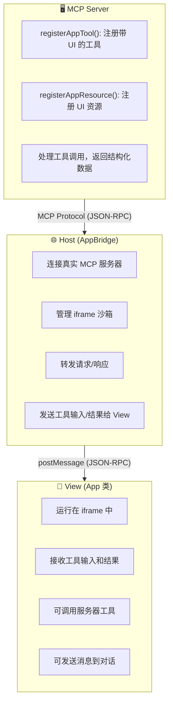
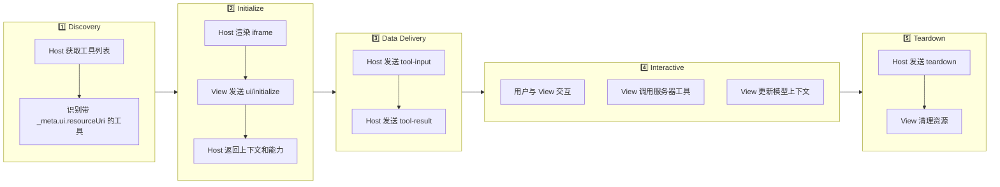
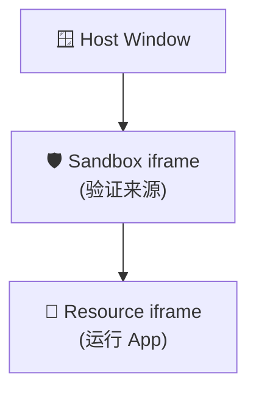

## 太长不看

- **MCP App 是什么**：运行在 MCP 宿主 iframe 中的交互式 UI 组件，让 AI Agent 能够返回可视化界面而非纯文本
- **核心公式**：MCP App = Tool + UI Resource，通过 `_meta.ui.resourceUri` 将工具与 UI 资源关联
- **多层安全**：iframe 沙箱隔离 + CSP 内容安全策略 + 权限声明 + 用户同意机制
- **广泛支持**：Claude、ChatGPT、VS Code、Goose 等主流客户端已支持，首次实现跨平台 UI 体验
- **生态意义**：打破"纯文本响应"范式，推动 AI Agent 生态从工具调用升级为完整应用平台

---

## 引言

2026 年 1 月 26 日，MCP 官方正式发布了 MCP Apps 1.0 稳定版。这是 MCP 协议的**第一个官方扩展**，标志着 AI Agent 生态从"工具调用"正式迈入"应用平台"时代。

想象这样一个场景：你让 AI 帮你分析销售数据，传统的 MCP 工具会返回一堆 JSON 数据或文本表格，你需要复制到 Excel 或其他工具中才能可视化。而有了 MCP App，AI 可以直接在对话中渲染一个**交互式仪表盘**——你可以悬停查看详情、点击筛选数据、拖拽调整图表，所有操作都在对话窗口内完成。

这不是科幻，这是 MCP App 正在做的事情。

本文将带你深入理解 MCP App 的方方面面：从诞生背景到架构设计，从协议规范到 SDK API，从安全模型到实战开发，一篇文章帮你彻底搞懂 MCP App。

---

## 第一部分：背景与动机

### 1.1 MCP 协议的局限性

Model Context Protocol (MCP) 在设计之初，主要解决的是 AI 模型与外部数据/工具的连接问题。MCP 定义了三种核心原语：

- **Tools（工具）**：让模型能够执行操作
- **Resources（资源）**：让模型能够读取数据
- **Prompts（提示词）**：让模型能够使用预设的提示模板

然而，MCP 原本只支持**文本和结构化数据**的交换。当工具需要可视化展示或复杂用户输入时，宿主必须自行构建渲染逻辑。这导致了一个尴尬的局面：

```text
用户: "帮我生成一个销售数据饼图"
Agent: "好的，这是数据：{sales: [{region: '华东', value: 3500}, ...]}，
        您可以复制到 Excel 或 ECharts 中生成图表"
```

开发者被迫创建各种 ad-hoc 解决方案，导致生态碎片化——每个宿主有自己的 UI 扩展方式，互不兼容。

### 1.2 社区需求的演进

社区对"UI over MCP"的需求早已显现：

**Working Group Issue #35**：2025 年中，社区在 MCP 工作组提出了 "UI Component Integration in MCP Responses" RFC，讨论如何在 MCP 响应中集成 UI 组件。

**MCP-UI 社区项目**：由 Ido Salomon 和 Liad Yosef 创建的 [MCP-UI](https://mcpui.dev/) 项目，在官方规范出台前就已积累了 4.2k+ stars，成为事实上的先行探索者。

社区的主要诉求包括：

- 交互式表单、按钮、多步工作流
- 实时数据可视化（图表、仪表盘）
- 配置向导（多选项、条件依赖）
- 富媒体查看器（PDF、3D 模型、视频）

### 1.3 Anthropic 与 OpenAI 的合作

2025 年 11 月，MCP 团队发布了 MCP Apps 的首次公开预览，整合了两个重要的外部贡献：

1. **MCP-UI 社区项目**：提供了 UI 资源的基础模式
2. **OpenAI Apps SDK**：ChatGPT 的 Widget 机制为协议设计提供了参考

经过数月的迭代，2026 年 1 月 26 日，MCP Apps 1.0 正式发布。这是一个罕见的**跨公司协作**案例——Anthropic、OpenAI、Block、Microsoft 等公司共同参与了规范的制定和实现。

---

## 第二部分：核心概念与架构

### 2.1 什么是 MCP App

**官方定义**：MCP App 是运行在 MCP 宿主 iframe 中的交互式 UI 组件。

**核心公式**：

```text
MCP App = Tool + UI Resource
```

一个 MCP App 由两部分组成：

1. **Tool（工具）**：声明了 `_meta.ui.resourceUri` 字段，指向 UI 资源
2. **UI Resource（UI 资源）**：包含 HTML/CSS/JS 的可交互界面

与传统 Web 应用的关键区别：

| 特性         | 传统 Web 应用      | MCP App                    |
| ------------ | ------------------ | -------------------------- |
| **上下文**   | 独立页面，跳出对话 | 嵌入对话流，保持上下文     |
| **数据流**   | 需自建 API、认证   | 可直接调用 MCP 服务器工具  |
| **集成能力** | 需单独实现各种集成 | 可委托宿主调用已连接的能力 |
| **安全隔离** | 完全信任或完全隔离 | iframe 沙箱 + CSP 精细控制 |

### 2.2 三层架构

MCP App 的架构分为三层：



**三层职责**：

1. **Server 层**：MCP 服务器，负责注册工具、处理业务逻辑、返回数据
2. **Host 层**：宿主应用（如 Claude Desktop），负责连接服务器、管理沙箱、转发消息
3. **View 层**：UI 组件，运行在 iframe 中，负责渲染界面、处理用户交互

### 2.3 生命周期

一个 MCP App 的完整生命周期如下：



### 2.4 URI 方案与 MIME 类型

**UI Resource URI**：

```text
ui://server-name/resource-path.html
```

`ui://` 是 MCP App 专用的 URI 方案，告诉宿主这是一个需要在 iframe 中渲染的 UI 资源。

**MIME Type**：

```text
text/html;profile=mcp-app
```

`profile=mcp-app` 参数传达了额外的语义约束——这不是普通的 HTML 页面，而是一个符合 MCP App 协议的交互式组件。

---

## 第三部分：协议规范详解

### 3.1 协议版本

| 版本           | 状态           | 链接                                                                                                                              |
| -------------- | -------------- | --------------------------------------------------------------------------------------------------------------------------------- |
| **2026-01-26** | Stable（稳定） | [specification/2026-01-26/apps.mdx](https://github.com/modelcontextprotocol/ext-apps/blob/main/specification/2026-01-26/apps.mdx) |
| draft          | Development    | [specification/draft/apps.mdx](https://github.com/modelcontextprotocol/ext-apps/blob/main/specification/draft/apps.mdx)           |

### 3.2 工具元数据 (Tool Metadata)

```typescript
interface McpUiToolMeta {
  ui?: {
    resourceUri: string; // 指向 UI 资源的 URI
    visibility?: ('model' | 'app')[]; // 可见性范围
  };
}
```

**visibility 字段详解**：

- `visibility: ["model"]` — 仅 LLM 可调用（默认）
- `visibility: ["app"]` — 仅 View 可调用，LLM 不可见
- `visibility: ["model", "app"]` — 两者均可调用

这个设计允许你创建"内部工具"——只有 UI 可以调用的辅助工具，对 LLM 隐藏。

### 3.3 资源元数据 (Resource Metadata)

```typescript
interface McpUiResourceMeta {
  ui?: {
    csp?: McpUiResourceCsp; // 内容安全策略
    permissions?: McpUiResourcePermissions; // 设备权限
    domain?: string; // 专用沙箱来源
    prefersBorder?: boolean; // 是否显示边框
  };
}
```

### 3.4 内容安全策略 (CSP)

CSP 是 MCP App 安全模型的核心组件：

```typescript
interface McpUiResourceCsp {
  connectDomains?: string[]; // 允许 fetch/XHR/WebSocket 连接的域
  resourceDomains?: string[]; // 允许加载静态资源的域（脚本、样式、图片）
  frameDomains?: string[]; // 允许嵌套 iframe 的域
  baseUriDomains?: string[]; // base-uri 指令
}
```

**默认行为**：Restrictive by Default（默认拒绝）

如果不声明任何 CSP 域，App 将无法：

- 发起任何外部网络请求
- 加载任何外部脚本或样式
- 嵌入任何外部 iframe

必须**显式声明**需要访问的外部域。

### 3.5 设备权限

```typescript
interface McpUiResourcePermissions {
  camera?: {}; // 摄像头
  microphone?: {}; // 麦克风
  geolocation?: {}; // 地理位置
  clipboardWrite?: {}; // 剪贴板写入
}
```

这些权限映射到 iframe 的 `allow` 属性，宿主会据此构建沙箱。

### 3.6 宿主上下文 (Host Context)

宿主在初始化时会向 View 发送上下文信息：

```typescript
interface McpUiHostContext {
  theme?: 'light' | 'dark';
  locale?: string;
  timezone?: string;
  displayMode?: 'inline' | 'fullscreen' | 'pip';
  safeAreaInsets?: { top?: number; right?: number; bottom?: number; left?: number };
  containerSize?: { width: number; height: number };
  platform?: 'web' | 'desktop' | 'mobile';
  capabilities?: McpUiHostCapabilities;
  styles?: McpUiHostStyles; // 30+ CSS 变量
}
```

### 3.7 样式变量系统

MCP App 定义了一套完整的 CSS 变量系统，让 App 能够适配宿主主题：

```css
/* 背景色 */
--color-background-primary
--color-background-secondary
--color-background-tertiary

/* 文本色 */
--color-text-primary
--color-text-secondary
--color-text-tertiary
--color-text-quaternary

/* 强调色 */
--color-accent-primary
--color-accent-secondary

/* 边框色 */
--color-border-primary
--color-border-secondary
--color-border-tertiary

/* 字体 */
--font-sans
--font-mono

/* 字重 */
--font-weight-normal
--font-weight-medium
--font-weight-semibold
--font-weight-bold
```

---

## 第四部分：SDK 与 API

### 4.1 NPM 包结构

```typescript
// 主 SDK - View 端
import { App, PostMessageTransport } from '@modelcontextprotocol/ext-apps';

// React 集成
import { useApp, useHostStyleVariables, useAutoResize } from '@modelcontextprotocol/ext-apps/react';

// Host 端
import {
  AppBridge,
  getToolUiResourceUri,
  buildAllowAttribute,
} from '@modelcontextprotocol/ext-apps/app-bridge';

// Server 助手
import {
  registerAppTool,
  registerAppResource,
  RESOURCE_MIME_TYPE,
} from '@modelcontextprotocol/ext-apps/server';
```

### 4.2 App 类 API (View 端)

`App` 类是 View 端的核心，提供与宿主通信的完整能力：

```typescript
class App extends Protocol {
  // 连接和生命周期
  connect(transport: Transport): Promise<void>;
  getHostContext(): McpUiHostContext | undefined;
  close(): Promise<void>;

  // 与服务器交互
  callServerTool(request: CallToolRequest): Promise<CallToolResult>;
  readServerResource(request: ReadResourceRequest): Promise<ReadResourceResult>;

  // 与宿主交互
  sendMessage(message: Message): Promise<{ isError: boolean }>;
  updateModelContext(context: McpUiUpdateModelContextRequest): Promise<void>;
  openLink(request: McpUiOpenLinkRequest): Promise<{ isError: boolean }>;
  requestDisplayMode(request: McpUiRequestDisplayModeRequest): Promise<void>;
  sendLog(log: { level: string; data: any }): Promise<void>;

  // 生命周期处理器
  ontoolinput?: (input: McpUiToolInputNotification) => void;
  ontoolresult?: (result: McpUiToolResultNotification) => void;
  ontoolcancelled?: (params: { reason?: string }) => void;
  onhostcontextchanged?: (context: McpUiHostContext) => void;
  onteardown?: () => Promise<any>;
}
```

### 4.3 AppBridge 类 API (Host 端)

`AppBridge` 是宿主端的桥接类，管理与 iframe 中 App 的通信：

```typescript
class AppBridge extends Protocol {
  connect(transport: Transport): Promise<void>;

  // 发送工具数据给 View
  sendToolInput(toolInput: McpUiToolInputNotification): Promise<void>;
  sendToolInputPartial(toolInputPartial: McpUiToolInputPartialNotification): Promise<void>;
  sendToolResult(toolResult: McpUiToolResultNotification): Promise<void>;
  sendToolCancelled(toolCancelled: McpUiToolCancelledNotification): Promise<void>;

  // 宿主上下文管理
  setHostContext(context: McpUiHostContext): Promise<void>;
  updateHostContext(context: Partial<McpUiHostContext>): Promise<void>;

  teardownResource(): Promise<void>;
}

// 辅助函数
function getToolUiResourceUri(tool: Partial<Tool>): string | undefined;
function buildAllowAttribute(permissions: McpUiResourcePermissions | undefined): string;
```

### 4.4 Server 助手函数

```typescript
function registerAppTool(
  server: McpServer,
  name: string,
  config: McpUiAppToolConfig,
  callback: ToolCallback
): RegisteredTool;

function registerAppResource(
  server: McpServer,
  name: string,
  uri: string,
  meta: ResourceMetadata,
  callback: ReadResourceCallback
): RegisteredResource;
```

### 4.5 React Hooks

```typescript
// 核心 Hook - 管理 App 连接和状态
function useApp(options: UseAppOptions): {
  app: App | null;
  toolInput: McpUiToolInputNotification | null;
  toolResult: McpUiToolResultNotification | null;
  hostContext: McpUiHostContext | undefined;
};

// 样式同步 - 将宿主 CSS 变量注入到文档
function useHostStyleVariables(app: App | null, initialContext?: McpUiHostContext): void;

// 主题同步 - 设置 data-theme 属性
function useDocumentTheme(app: App | null, initialContext?: McpUiHostContext): void;

// 自动调整大小 - 通知宿主 View 尺寸变化
function useAutoResize(app: App | null, autoResize?: boolean): void;
```

---

## 第五部分：通信协议详解

### 5.1 传输层

MCP App 使用 `PostMessageTransport`，基于 `window.postMessage` 实现 JSON-RPC 2.0 协议。

```typescript
const transport = new PostMessageTransport({
  targetOrigin: '*', // 或指定具体的宿主 origin
});
await app.connect(transport);
```

### 5.2 请求类型

| 方法                      | 方向        | 用途           |
| ------------------------- | ----------- | -------------- |
| `ui/initialize`           | View → Host | 初始化握手     |
| `ui/message`              | View → Host | 发送消息到对话 |
| `ui/update-model-context` | View → Host | 更新模型上下文 |
| `ui/open-link`            | View → Host | 打开外部链接   |
| `ui/request-display-mode` | View → Host | 请求显示模式   |
| `ui/resource-teardown`    | Host → View | 资源清理       |
| `tools/call`              | View → Host | 调用服务器工具 |
| `tools/list`              | View → Host | 列出可用工具   |
| `resources/read`          | View → Host | 读取资源       |

### 5.3 通知类型

| 方法                                    | 方向        | 用途                 |
| --------------------------------------- | ----------- | -------------------- |
| `ui/notifications/initialized`          | View → Host | 初始化完成           |
| `ui/notifications/size-changed`         | View → Host | 尺寸变化             |
| `ui/notifications/tool-input`           | Host → View | 工具输入数据         |
| `ui/notifications/tool-input/partial`   | Host → View | 流式输入（部分数据） |
| `ui/notifications/tool-result`          | Host → View | 工具结果             |
| `ui/notifications/tool-cancelled`       | Host → View | 工具已取消           |
| `ui/notifications/host-context-changed` | Host → View | 宿主上下文变化       |

### 5.4 完整通信序列图

```mermaid
sequenceDiagram
    participant V as View (iframe)
    participant H as Host (AppBridge)
    participant S as MCP Server

    rect rgb(40, 35, 30)
        Note over V,H: 初始化阶段
        H->>V: render iframe
        V->>H: ui/initialize
        H-->>V: {context, capabilities}
        V->>H: ui/notifications/initialized
    end

    rect rgb(35, 40, 35)
        Note over V,S: 数据交付阶段
        S->>H: tool call
        H->>V: tool-input notification
        S->>H: tool result
        H->>V: tool-result notification
    end

    rect rgb(35, 35, 40)
        Note over V,S: 交互阶段
        V->>H: tools/call
        H->>S: tools/call
        S-->>H: result
        H-->>V: result
    end

    rect rgb(40, 30, 30)
        Note over V,H: 清理阶段
        H->>V: ui/resource-teardown
        V-->>H: acknowledgment
    end
```



---

## 第六部分：安全模型

### 6.1 多层防护

MCP App 采用**纵深防御**策略，包含多层安全机制：

1. **iframe 沙箱**：所有 UI 内容运行在沙箱 iframe 中
2. **预声明模板**：宿主可在执行前审查 HTML 内容
3. **可审计消息**：所有 UI-Host 通信基于 JSON-RPC，可记录和审计
4. **用户同意**：View 发起的工具调用可要求用户确认
5. **CSP 控制**：细粒度的外部域访问控制

### 6.2 iframe 沙箱属性

```typescript
function buildAllowAttribute(permissions?: McpUiResourcePermissions): string {
  const allows = [
    'allow-scripts', // 允许执行脚本
    'allow-forms', // 允许提交表单
    'allow-same-origin', // 允许同源访问（postMessage 必需）
  ];

  // 根据声明的权限动态添加
  if (permissions?.camera) allows.push('camera');
  if (permissions?.microphone) allows.push('microphone');
  if (permissions?.geolocation) allows.push('geolocation');
  if (permissions?.clipboardWrite) allows.push('clipboard-write');

  return allows.join('; ');
}
```

**注意**：`allow-same-origin` 是 postMessage 通信的必要条件，但不会授予 App 访问父窗口 DOM 的能力。

### 6.3 双层 iframe 架构（推荐）

为了进一步增强安全性，规范建议使用**双层 iframe 架构**：



- **外层 iframe**：作为安全代理，验证内层消息的来源
- **内层 iframe**：实际运行 App

这种架构可以防止恶意 App 伪造消息来源。

---

## 第七部分：显示模式

### 7.1 三种模式

| 模式         | 说明       | 适用场景             |
| ------------ | ---------- | -------------------- |
| `inline`     | 嵌入对话流 | 默认模式，小型组件   |
| `fullscreen` | 全屏覆盖   | 复杂交互、沉浸式体验 |
| `pip`        | 画中画     | 持续监控、视频播放   |

### 7.2 模式切换

```typescript
// View 请求切换到全屏模式
await app.requestDisplayMode({ mode: 'fullscreen' });

// 监听模式变化
app.onhostcontextchanged = context => {
  if (context.displayMode) {
    console.log('Display mode changed to:', context.displayMode);
    // 根据模式调整布局
  }
};
```

### 7.3 响应式设计要点

```typescript
// 使用 containerSize 适应容器
const { width, height } = hostContext.containerSize ?? {};

// 处理刘海屏等安全区域
const { top, right, bottom, left } = hostContext.safeAreaInsets ?? {};

// 根据平台调整触控交互
if (hostContext.platform === 'mobile') {
  // 增大点击目标、优化手势
}
```

---

## 第八部分：实战开发指南

### 8.1 项目结构（推荐）

```
my-mcp-app/
├── src/
│   ├── server/
│   │   └── index.ts        # MCP 服务器
│   └── view/
│       ├── index.html      # View 入口
│       ├── app.tsx         # React 组件
│       └── styles.css      # 样式
├── dist/                   # 构建输出
├── package.json
├── tsconfig.json
└── vite.config.ts
```

### 8.2 最小示例 - 服务器端

```typescript
import { McpServer } from '@modelcontextprotocol/sdk/server/mcp.js';
import {
  registerAppTool,
  registerAppResource,
  RESOURCE_MIME_TYPE,
} from '@modelcontextprotocol/ext-apps/server';
import { readFileSync } from 'fs';

const server = new McpServer({
  name: 'my-app',
  version: '1.0.0',
});

const resourceUri = 'ui://my-app/dashboard.html';

// 注册带 UI 的工具
registerAppTool(
  server,
  'show-dashboard',
  {
    title: 'Show Dashboard',
    description: '显示交互式仪表盘',
    inputSchema: {
      type: 'object',
      properties: {
        data: { type: 'array', description: '要展示的数据' },
      },
    },
    _meta: {
      ui: { resourceUri },
    },
  },
  async args => {
    // 工具逻辑 - 返回的数据会通过 tool-result 发送给 View
    return {
      content: [{ type: 'text', text: 'Dashboard ready' }],
      structuredContent: { chartData: args.data },
    };
  }
);

// 注册 UI 资源
registerAppResource(
  server,
  'dashboard',
  resourceUri,
  { mimeType: RESOURCE_MIME_TYPE },
  async () => {
    const html = readFileSync('./dist/dashboard.html', 'utf-8');
    return {
      contents: [{ uri: resourceUri, text: html }],
    };
  }
);
```

### 8.3 最小示例 - View 端 (Vanilla JS)

```html
<!DOCTYPE html>
<html>
  <head>
    <script type="module">
      import { App, PostMessageTransport } from '@modelcontextprotocol/ext-apps';

      const app = new App({ name: 'my-view', version: '1.0.0' });
      const transport = new PostMessageTransport();

      // 处理工具输入（工具被调用时的参数）
      app.ontoolinput = input => {
        console.log('Tool input:', input);
      };

      // 处理工具结果（工具执行完成后的数据）
      app.ontoolresult = result => {
        const data = result.structuredContent?.chartData;
        document.getElementById('result').textContent = JSON.stringify(data, null, 2);
      };

      await app.connect(transport);
    </script>
  </head>
  <body>
    <div id="result">Loading...</div>
  </body>
</html>
```

### 8.4 最小示例 - View 端 (React)

```tsx
import { useApp, useHostStyleVariables } from '@modelcontextprotocol/ext-apps/react';

export default function Dashboard() {
  const { app, toolInput, toolResult, hostContext } = useApp({
    name: 'my-view',
    version: '1.0.0',
  });

  // 自动应用宿主主题的 CSS 变量
  useHostStyleVariables(app, hostContext);

  // 主动调用服务器工具
  const handleRefresh = async () => {
    const result = await app?.callServerTool({
      name: 'get-data',
      arguments: { filter: 'recent' },
    });
    console.log('Fresh data:', result);
  };

  return (
    <div
      style={{
        background: 'var(--color-background-primary)',
        color: 'var(--color-text-primary)',
      }}
    >
      <h1>Dashboard</h1>
      <button onClick={handleRefresh}>Refresh Data</button>
      <pre>{JSON.stringify(toolResult?.structuredContent, null, 2)}</pre>
    </div>
  );
}
```

### 8.5 构建配置 (Vite)

```typescript
// vite.config.ts
import { defineConfig } from 'vite';
import react from '@vitejs/plugin-react';
import { viteSingleFile } from 'vite-plugin-singlefile';

export default defineConfig({
  plugins: [react(), viteSingleFile()],
  build: {
    outDir: 'dist',
    rollupOptions: {
      input: process.env.INPUT || 'src/view/index.html',
    },
  },
});
```

`viteSingleFile` 插件会将所有资源内联到单个 HTML 文件中，这是 MCP App 的推荐做法——简化分发，避免外部依赖。

---

## 第九部分：高级模式

### 9.1 App-Only 工具

创建仅 UI 可调用的"内部工具"：

```typescript
registerAppTool(
  server,
  'internal-fetch',
  {
    description: 'Internal data fetching (UI only)',
    inputSchema: {
      type: 'object',
      properties: {
        endpoint: { type: 'string' },
      },
    },
    _meta: {
      ui: {
        resourceUri: 'ui://app/view.html',
        visibility: ['app'], // 关键：仅 app 可见，LLM 不可调用
      },
    },
  },
  async args => {
    const data = await fetchInternal(args.endpoint);
    return { content: [{ type: 'text', text: JSON.stringify(data) }] };
  }
);
```

### 9.2 大数据分块加载

```typescript
// 服务器端 - 支持分页
registerAppTool(
  server,
  'load-data',
  {
    inputSchema: {
      type: 'object',
      properties: {
        offset: { type: 'number', default: 0 },
        limit: { type: 'number', default: 100 },
      },
    },
    _meta: { ui: { resourceUri, visibility: ['app'] } },
  },
  async args => {
    const { offset = 0, limit = 100 } = args;
    const data = await fetchData(offset, limit);
    return {
      content: [{ type: 'text', text: `Loaded ${data.length} items` }],
      structuredContent: {
        items: data,
        hasMore: data.length === limit,
        nextOffset: offset + data.length,
      },
    };
  }
);

// View 端 - 增量加载
const loadMore = async () => {
  const result = await app.callServerTool({
    name: 'load-data',
    arguments: { offset: items.length, limit: 100 },
  });
  const { items: newItems, hasMore } = result.structuredContent;
  setItems(prev => [...prev, ...newItems]);
  setHasMore(hasMore);
};
```

### 9.3 更新模型上下文

让 LLM 知道用户在 UI 中做了什么：

```typescript
// 用户在 UI 中选择了某个选项
const handleSelection = async selectedItem => {
  // 更新模型上下文，让 LLM 知道用户的选择
  await app.updateModelContext({
    content: [
      {
        type: 'text',
        text: `用户在仪表盘中选择了: ${selectedItem.name} (ID: ${selectedItem.id})`,
      },
    ],
  });
};
```

这样，当用户接下来问"帮我分析刚才选的那个"时，LLM 就知道是什么。

### 9.4 流式工具输入

当工具输入数据较大时，宿主可以分块发送：

```typescript
// View 端 - 处理部分输入
app.ontoolinputpartial = partial => {
  // 显示加载进度
  setLoadingText(partial.input?.partialText || 'Loading...');
};

app.ontoolinput = input => {
  // 完整输入到达
  setLoadingText(null);
  processInput(input);
};
```

### 9.5 主题同步

```typescript
// 自动应用宿主主题
app.onhostcontextchanged = context => {
  // 设置 data-theme 属性
  document.documentElement.dataset.theme = context.theme;

  // 应用 CSS 变量
  if (context.styles) {
    for (const [key, value] of Object.entries(context.styles)) {
      document.documentElement.style.setProperty(key, value);
    }
  }
};
```

---

## 第十部分：与 OpenAI Apps SDK 对比

### 10.1 关系说明

- **ext-apps（MCP Apps）**：MCP 官方规范 + SDK，跨平台标准
- **OpenAI Apps SDK**：ChatGPT 特定实现，基于 MCP Apps 规范

两者**不是竞争关系**，而是**规范与实现**的关系。OpenAI Apps SDK 是 MCP Apps 规范在 ChatGPT 平台上的官方实现。

### 10.2 主要差异

| 方面           | ext-apps (MCP Apps) | OpenAI Apps SDK                   |
| -------------- | ------------------- | --------------------------------- |
| **定位**       | 协议规范 + 通用 SDK | ChatGPT 特定框架                  |
| **元数据前缀** | 无特定前缀          | `openai/*`                        |
| **状态管理**   | 由 App 自行实现     | `widgetSessionId` + `widgetState` |
| **传输方式**   | stdio, SSE, HTTP    | 主要 SSE                          |
| **UI 库**      | 任意                | `@openai/apps-sdk-ui`             |
| **认证**       | 通过 MCP 标准       | OAuth RFC 9728                    |

### 10.3 迁移指南

从 OpenAI Apps SDK 迁移到 MCP Apps：

```typescript
// OpenAI Apps SDK
const meta = {
  'openai/outputTemplate': 'ui://widget/view.html',
  'openai/widgetSessionId': sessionId,
  'openai/widgetState': { count: 0 },
};

// MCP Apps (ext-apps)
const meta = {
  ui: { resourceUri: 'ui://widget/view.html' },
};
// 状态管理通过 updateModelContext 或自定义工具实现
```

### 10.4 OpenAI 特有功能

OpenAI Apps SDK 提供了一些 ChatGPT 特定的 API：

```typescript
// 从 Widget 调用工具
window.openai.callTool({ name: "search", arguments: {...} })

// 发送后续消息（触发新的 LLM 响应）
window.openai.sendFollowUpMessage("继续分析...")

// 打开模态框
window.openai.requestModal({ ... })

// widgetState 自动持久化到会话
```

---

## 第十一部分：客户端支持

### 11.1 已支持的客户端

| 客户端                     | 状态      | 备注                   |
| -------------------------- | --------- | ---------------------- |
| **Claude (Web & Desktop)** | ✅ 已支持 | 首批支持，完整实现     |
| **ChatGPT**                | ✅ 已支持 | 2026-01-26 发布周上线  |
| **Goose**                  | ✅ 已支持 | Block 开源项目         |
| **VS Code Insiders**       | ✅ 已支持 | GitHub Copilot 集成    |
| **Postman**                | ✅ 已支持 | API 测试工具           |
| **MCPJam**                 | ✅ 已支持 | 社区客户端             |
| **JetBrains IDEs**         | 🚧 开发中 | 已表达支持意向         |
| **AWS (Bedrock)**          | 🚧 开发中 | 已表达支持意向         |
| **Google DeepMind**        | 🚧 开发中 | Antigravity 团队探索中 |

### 11.2 配置示例 (Claude Desktop)

```json
{
  "mcpServers": {
    "my-app": {
      "command": "node",
      "args": ["path/to/server.js"]
    }
  }
}
```

### 11.3 配置示例 (VS Code)

```json
{
  "mcpServers": {
    "my-app": {
      "command": "npx",
      "args": ["-y", "@modelcontextprotocol/server-my-app", "--stdio"]
    }
  }
}
```

---

## 第十二部分：示例项目速览

### 12.1 ext-apps 官方示例

| 类别          | 示例                         | 技术栈     | 演示功能        |
| ------------- | ---------------------------- | ---------- | --------------- |
| **基础模板**  | basic-server-react           | React      | 基础 Hooks 使用 |
|               | basic-server-vue             | Vue 3      | 组合式 API      |
|               | basic-server-svelte          | Svelte     | 响应式编程      |
|               | basic-server-vanillajs       | Vanilla JS | 无框架实现      |
| **3D/可视化** | map-server                   | CesiumJS   | 3D 地球         |
|               | threejs-server               | Three.js   | 3D 场景         |
|               | shadertoy-server             | GLSL       | 实时着色器      |
| **文档媒体**  | pdf-server                   | PDF.js     | PDF 分块加载    |
|               | video-resource-server        | -          | 二进制视频      |
|               | sheet-music-server           | abc2svg    | 乐谱渲染        |
| **数据分析**  | cohort-heatmap-server        | ECharts    | 留存热力图      |
|               | customer-segmentation-server | -          | 聚类散点图      |
|               | wiki-explorer-server         | Cytoscape  | 知识图谱        |
| **商业应用**  | scenario-modeler-server      | -          | SaaS 财务预测   |
|               | budget-allocator-server      | -          | 预算分配        |
| **工具**      | system-monitor-server        | -          | 实时系统监控    |
|               | transcript-server            | WebAPI     | 语音转录        |
|               | qr-server (Python)           | -          | 二维码生成      |

### 12.2 运行示例

```bash
# 克隆仓库
git clone https://github.com/modelcontextprotocol/ext-apps.git
cd ext-apps

# 安装依赖
npm install

# 启动所有示例（使用 basic-host）
npm start

# 访问 http://localhost:8080/
```

---

## 第十三部分：测试与调试

### 13.1 本地测试

使用 `basic-host` 测试你的 MCP App：

```bash
# 启动 basic-host
cd ext-apps/examples/basic-host
npm install && npm start

# 在另一个终端启动你的服务器
cd your-app && npm run serve

# 配置 basic-host 连接你的服务器
SERVERS='["http://localhost:3001"]' npm start
```

### 13.2 使用 Claude 测试

```bash
# 使用 cloudflared 暴露本地服务器
npx cloudflared tunnel --url http://localhost:3001

# 复制生成的 URL（如 https://xxx.trycloudflare.com）
# 在 Claude 设置中添加为 Custom Connector
```

### 13.3 常见问题排查

| 问题             | 可能原因         | 解决方案                                |
| ---------------- | ---------------- | --------------------------------------- |
| 外部请求被阻止   | CSP 未声明域     | 在 `_meta.ui.csp.connectDomains` 添加域 |
| postMessage 失败 | 沙箱配置错误     | 确保 `allow-same-origin` 存在           |
| 主题不同步       | 未监听上下文变化 | 实现 `onhostcontextchanged` 处理器      |
| 工具调用超时     | 服务器响应慢     | 检查服务器日志，优化处理逻辑            |
| UI 不显示        | 资源加载失败     | 检查 resourceUri 是否正确               |

---

## 第十四部分：最佳实践

### 14.1 应该做的 ✅

- **使用 CSS 变量实现主题适配**：让你的 App 在明暗主题下都有良好表现
- **响应 displayMode 变化**：根据 inline/fullscreen/pip 调整布局
- **提供文本 fallback**：支持不支持 MCP App 的客户端
- **使用 TypeScript**：确保类型安全，减少运行时错误
- **分块加载大数据集**：避免一次性传输过多数据
- **显式声明所需的 CSP 域**：最小权限原则
- **实现 teardown 清理**：释放资源、取消订阅

### 14.2 不应该做的 ❌

- **在 View 中存储敏感数据**：iframe 可能被其他脚本访问
- **假设固定的容器尺寸**：使用响应式设计
- **忽略 teardown 事件**：可能导致内存泄漏
- **使用 `*` 通配符 CSP 域**：安全风险
- **阻塞主线程**：使用 Web Worker 处理耗时操作
- **依赖外部 CDN 不声明**：会被 CSP 阻止

### 14.3 性能优化

```typescript
// 1. 使用 viteSingleFile 内联所有资源
import { viteSingleFile } from 'vite-plugin-singlefile';

// 2. 启用 gzip 压缩
// 服务器返回时设置 Content-Encoding: gzip

// 3. 懒加载重型库
const loadThreeJs = () => import('three');

// 4. 使用 requestIdleCallback 处理非关键任务
requestIdleCallback(() => {
  // 预加载、分析等非关键操作
});

// 5. 使用虚拟滚动处理长列表
// 推荐：react-window, vue-virtual-scroller
```

---

## 第十五部分：MCP App 的影响与变革

### 15.1 对 AI 生态的影响

#### 打破"纯文本响应"的范式

传统的 AI Agent 只能返回文本。即使有"代码执行"能力，最终呈现给用户的仍然是文本或静态图片。

MCP App 改变了这一点：

```
Before MCP App:
User: "帮我生成一个饼图展示销售数据"
Agent: "好的，这是数据：{...}，您可以复制到 Excel 中生成图表"

After MCP App:
User: "帮我生成一个饼图展示销售数据"
Agent: [直接渲染交互式 ECharts 饼图，支持悬停查看详情、导出图片]
```

#### 推动 Agent 生态标准化

MCP App 是**第一个跨公司、跨平台**的 AI Agent UI 标准：

- Anthropic、OpenAI、Block、Microsoft 共同参与
- 同一个 MCP App 可以在 Claude、ChatGPT、VS Code 中运行
- 开发者只需写一次代码

这避免了生态碎片化——不会出现"Claude 专用插件"、"ChatGPT 专用 Widget"的局面。

#### 企业级 AI 应用加速

根据 Forrester 2026 预测，**30% 的企业应用厂商**将推出自己的 MCP 服务器。

MCP App 让企业能够：

- 将内部系统封装为 MCP App，向 AI Agent 暴露能力
- 避免供应商锁定，灵活选择 AI 平台
- 统一内部工具的 AI 集成标准

### 15.2 对开发者的影响

#### 新的技能要求

| 传统 MCP 开发    | MCP App 开发            |
| ---------------- | ----------------------- |
| 后端为主         | 前后端结合              |
| JSON 数据处理    | UI/UX 设计              |
| 无需考虑安全沙箱 | 需理解 CSP、iframe 安全 |
| 单平台适配       | 跨平台主题/响应式       |

#### 降低分发门槛

- **无需独立部署**：UI 作为资源嵌入 MCP Server
- **无需应用商店审核**：配置 MCP 服务器即可使用
- **即时更新**：修改代码即生效，无需用户升级

### 15.3 对产品交互的变革

| 场景       | 传统体验               | MCP App 体验       |
| ---------- | ---------------------- | ------------------ |
| 数据可视化 | 返回数据让用户自己画图 | 直接渲染交互式图表 |
| 表单填写   | 多轮对话逐个询问字段   | 一次性表单输入     |
| 文件预览   | 返回下载链接           | 内嵌 PDF/3D 查看器 |
| 配置向导   | 逐步文字引导           | 可视化步骤指示器   |
| 地图导航   | 返回地址文本           | 嵌入交互式地图     |

---

## 第十六部分：与 Google A2UI 的对比

### 16.1 A2UI 简介

**A2UI（Agent-to-User Interface）** 是 Google 于 2025 年 12 月发布的另一个 Agent UI 协议。

核心理念：**声明式组件描述**，而非可执行代码。

```
Agent 输出 A2UI JSON 描述
        ↓
Client 读取组件描述
        ↓
映射到本地原生组件
        ↓
用户看到原生风格的 UI
```

### 16.2 核心差异

| 维度           | MCP Apps                   | Google A2UI               |
| -------------- | -------------------------- | ------------------------- |
| **核心理念**   | 嵌入式 Web 应用            | 声明式组件描述            |
| **UI 实现**    | 完整 HTML/CSS/JS（iframe） | JSON 组件声明（原生渲染） |
| **灵活性**     | 高（可用任意前端技术）     | 受限（只能用预定义组件）  |
| **安全模型**   | iframe 沙箱 + CSP          | 组件白名单目录            |
| **开发门槛**   | 需前端开发经验             | LLM 可直接生成            |
| **渲染一致性** | 跨平台保持一致             | 依赖各平台原生实现        |

### 16.3 技术路线对比

**MCP Apps："Mini Web App"路线**

```typescript
// 返回完整 HTML
registerAppResource(
  server,
  'chart',
  'ui://app/chart.html',
  {
    mimeType: RESOURCE_MIME_TYPE,
  },
  async () => ({
    contents: [
      {
        uri: 'ui://app/chart.html',
        text: `
      <html>
        <script src="echarts.min.js"></script>
        <script>echarts.init(...)</script>
        <div id="chart"></div>
      </html>
    `,
      },
    ],
  })
);
```

**A2UI："Native-First 声明式"路线**

```json
{
  "components": [
    {
      "id": "chart1",
      "type": "PieChart",
      "props": {
        "data": [{ "label": "A", "value": 30 }],
        "title": "Sales"
      }
    }
  ]
}
```

### 16.4 如何选择

| 场景                          | 推荐方案           |
| ----------------------------- | ------------------ |
| 简单表单、列表、卡片          | A2UI（更轻量）     |
| 复杂数据可视化（ECharts、D3） | MCP Apps（更灵活） |
| 3D/地图/富媒体                | MCP Apps（必需）   |
| 希望原生系统体验              | A2UI               |
| 需要复杂交互逻辑              | MCP Apps           |
| LLM 直接生成 UI               | A2UI               |
| 复用现有 Web 组件             | MCP Apps           |

### 16.5 可能的融合方向

两者并非完全互斥，未来可能：

- MCP App 内部使用 A2UI 描述动态生成的 UI 片段
- A2UI 组件目录扩展支持嵌入 MCP App
- 统一的 "Agent UI 协议" 整合两种模式

---

## 第十七部分：未来发展方向

### 17.1 协议层面

- **更多显示模式**：除 inline/fullscreen/pip 外，可能增加 modal、sidebar 等
- **增强权限控制**：更细粒度的设备访问、网络请求控制
- **与 A2UI 的融合**：混合使用声明式组件和嵌入式 App

### 17.2 生态扩展

- **更多客户端支持**：JetBrains、AWS Bedrock、Google 等
- **组件模板库**：常用 UI 模式的开箱即用模板
- **可视化构建工具**：低代码/无代码 MCP App 构建器

### 17.3 技术能力增强

- **多 App 协同**：App 间状态共享和消息传递
- **离线与持久化**：Service Worker 缓存、跨会话状态保留
- **更多设备权限**：蓝牙、NFC、传感器等

### 17.4 垂直领域深化

- **医疗健康**：DICOM 医学影像查看器
- **金融服务**：实时行情图表、风险仪表盘
- **工程设计**：CAD 预览器、BIM 模型查看
- **教育培训**：交互式课件、编程练习环境

---

## 结论

MCP App 是 MCP 协议的**历史性扩展**，标志着 AI Agent 生态从"工具调用"升级为"应用平台"。

**关键要点回顾**：

1. **MCP App = Tool + UI Resource**，通过 `_meta.ui.resourceUri` 关联
2. **三层架构**：Server → Host → View，通过 JSON-RPC 通信
3. **多层安全**：iframe 沙箱 + CSP + 权限声明 + 用户同意
4. **跨平台支持**：Claude、ChatGPT、VS Code、Goose 等
5. **生态意义**：打破纯文本范式，推动 Agent UI 标准化

如果你正在开发 MCP 服务器，是时候考虑为你的工具添加交互式 UI 了。MCP App 让 AI Agent 真正成为一个**可视化的应用平台**，而不仅仅是一个对话框。

---

## 参考资料

### 官方资源

- [ext-apps 官方仓库](https://github.com/modelcontextprotocol/ext-apps)
- [MCP Apps 官方文档](https://modelcontextprotocol.io/docs/extensions/apps)
- [API 文档](https://modelcontextprotocol.github.io/ext-apps/api/)
- [规范文档 (2026-01-26)](https://github.com/modelcontextprotocol/ext-apps/blob/main/specification/2026-01-26/apps.mdx)

### 博客文章

- [MCP Apps 1.0 发布公告 (2026-01-26)](https://blog.modelcontextprotocol.io/posts/2026-01-26-mcp-apps/)
- [MCP Apps 预览版公告 (2025-11-21)](https://blog.modelcontextprotocol.io/posts/2025-11-21-mcp-apps/)

### 相关项目

- [MCP-UI 社区项目](https://github.com/MCP-UI-Org/mcp-ui)
- [OpenAI Apps SDK](https://developers.openai.com/apps-sdk/)
- [Google A2UI](https://a2ui.org/)

### 社区讨论

- [SEP-1865 PR](https://github.com/modelcontextprotocol/modelcontextprotocol/pull/1865)
- [Working Group Issue #35](https://github.com/modelcontextprotocol-community/working-groups/issues/35)
